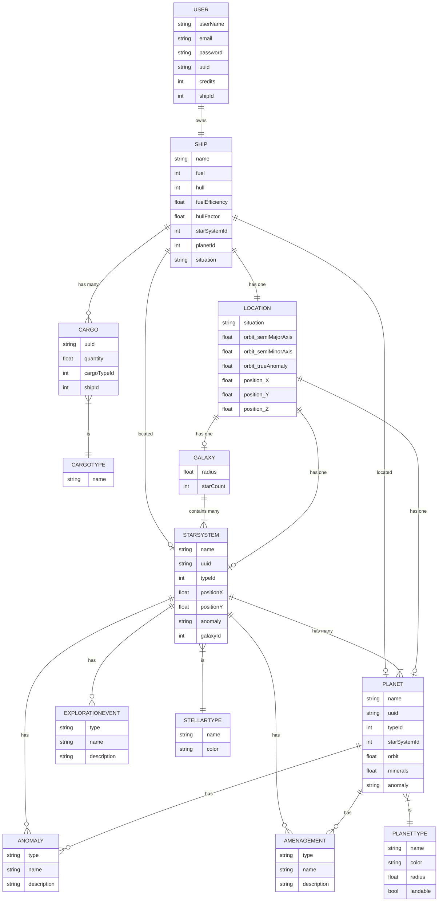

# VUE FTL Database

This project is only there to store the sqlite Database for developpement, sequelize testing and data schema

## Sequelize trick

create = build + save
https://sequelize.org/docs/v6/core-concepts/assocs/#special-methodsmixins-added-to-instances

## Database Schema

