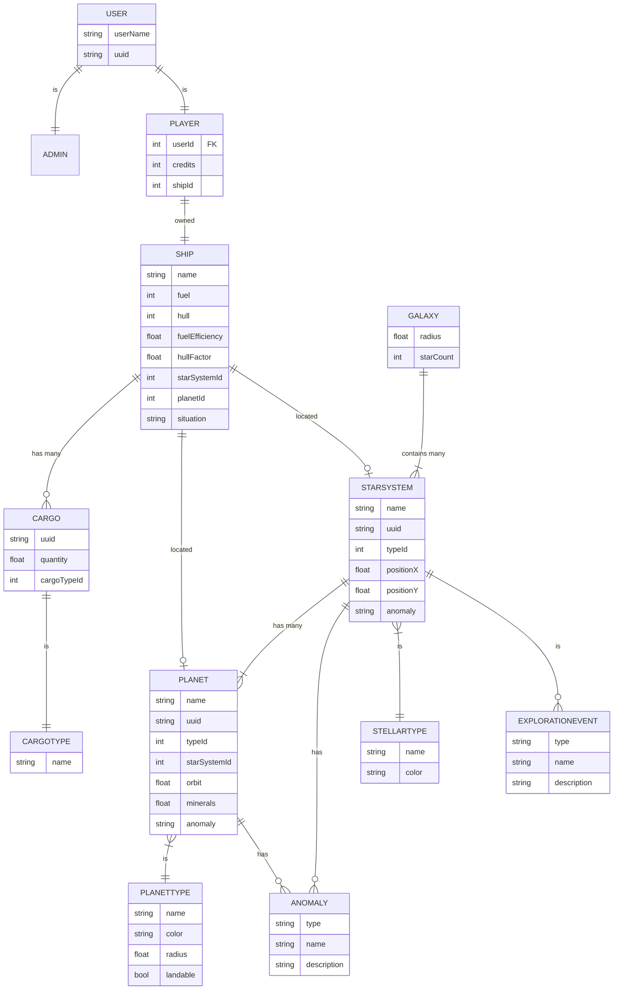

# VUE FTL Database

## Database Schema

```mermaid
erDiagram
    USER ||--|| PLAYER : is
    USER ||--|| ADMIN : is
    USER {
        string userName
        string uuid
    }
    ADMIN {
    }
    PLAYER ||--|| SHIP : owned
    PLAYER {
        int userId FK
        int credits
        int shipId
    }
    SHIP ||--o| STARSYSTEM : located
    SHIP ||--o| PLANET : located
    SHIP ||--o{ CARGO : "has many"
    SHIP {
        string name
        int fuel
        int hull
        float fuelEfficiency
        float hullFactor
        int starSystemId
        int planetId
        string situation
    }
    CARGO ||--|| CARGOTYPE : is
    CARGO {
        string uuid
        float quantity
        int cargoTypeId
    }
    CARGOTYPE {
        string name
    }
    GALAXY ||--|{ STARSYSTEM : "contains many"
    GALAXY{
        float radius
        int starCount
    }
    STARSYSTEM ||--o{ EXPLORATIONEVENT : is
    STARSYSTEM }|--|| STELLARTYPE : is
    STARSYSTEM ||--o{ ANOMALY : has
    STARSYSTEM ||--|{ PLANET : "has many"
    STARSYSTEM {
        string name
        string uuid	
        int typeId
        float positionX
        float positionY
        string anomaly
    }
    STELLARTYPE {
        string name
        string color
    }
    PLANET ||--o{ ANOMALY : has
    PLANET }|--|| PLANETTYPE : is
    PLANET {
        string name
        string uuid	
        int typeId
        int starSystemId
        float orbit
        float minerals
        string anomaly
    }
    PLANETTYPE {
        string name
        string color
        float radius
        bool landable
    }
    ANOMALY {
        string type
        string name
        string description
    }
    EXPLORATIONEVENT {
        string type
        string name
        string description
    }
```